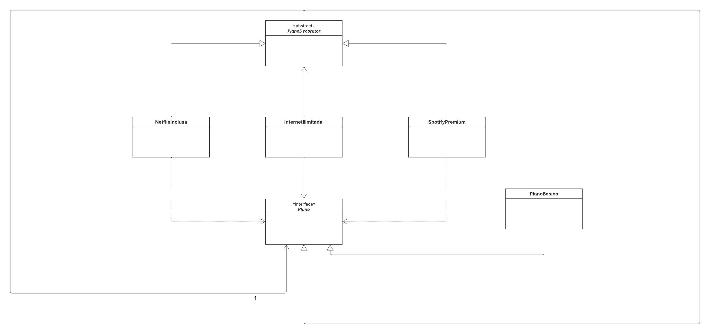

# 🌐 Sistema de Agendamento e Customização de Planos de Internet

Este projeto demonstra a aplicação do **Padrão Decorator** (Padrão Estrutural) em Java para criar e customizar dinamicamente planos de serviço, adicionando benefícios e calculando o custo final de forma flexível.

## 📌 Objetivo

O principal objetivo é simular a montagem de um plano de internet onde o cliente pode adicionar serviços extras (como streaming e internet ilimitada) ao plano base, garantindo que o custo e a descrição sejam atualizados automaticamente.

## 📌 Diagrama de Classes

## 👩‍💻 Autora
**Eduarda Araujo Carvalho** 
